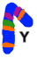

[![Contributors][contributors-shield]][contributors-url]
[![Forks][forks-shield]][forks-url]
[![Stargazers][stars-shield]][stars-url]
[![Issues][issues-shield]][issues-url]
[![MIT License][license-shield]][license-url]

<!-- PROJECT LOGO -->
<br />
<p align="center">
  <a href="https://github.com/isabela42/OligoY">
    
  </a>

  <h3 align="center">Oligopaint the Y Chromosome</h3>
</p>

<!-- TABLE OF CONTENTS -->
<details open="open">
  <summary><h2 style="display: inline-block">Table of Contents</h2></summary>
  <ol>
    <li>
      <a href="#overview">Overview</a>
    </li>
    <li>
      <a href="#getting-started">Getting Started</a>
      <ul>
        <li><a href="#pipeline-prerequisites">Pipeline Prerequisites</a></li>
        <li><a href="#ygs-prerequisites">YGS Prerequisites</a></li>
        <li><a href="#blobtools-prerequisites-and-installation">Blobtools Prerequisites and Installation</a></li>
        <li><a href="#oligominer-prerequisites-and-installation">OligoMiner Prerequisites and Installation</a></li>
      </ul>
    </li>
    <li><a href="#usage">Usage</a></li>
    <ul>
        <li><a href="#run-ygs">Run YGS</a></li>
        <li><a href="#run-blobtools">Run BlobTools</a></li>
        <li><a href="#design-yw-oligopaint-probes">Design Y/W Oligopaint Probes</a></li>
      </ul>
    <li><a href="#license">License</a></li>
    <li><a href="#contact">Contact</a></li>
  </ol>
</details>

<!-- ABOUT THE PROJECT -->
## Overview

This is a pipeline for designing oligopaint probes for the Y/W Chromosome of any species of interest.

The logical structure of the pipeline follows the:
1. Identification of the Y/W Chromosome unique sequences
2. Removal of contaminant sequences;
3. Design of Oligopaint probes;
4. Addition of priming sequences.

When combined, these four steps grant the user the autonomy to choose parameters and ensure that the designed probes maximize the efficiency of FISH experiments.

<!-- GETTING STARTED -->
## Getting Started

This session is devided acording to each step of the pipeline. To get a local copy up and running follow these simple steps:

### Pipeline Prerequisites

Or pipeline runs on Bash scripts. You can choose to clone the repo 
  
   ```sh
   git clone https://github.com/isabela42/OligoY.git
   ```

or to run individual commands as specified on XXXX

### [YGS](https://doi.org/10.1101/gr.156034.113) Prerequisites

1. Jellyfish [(Marçais & Kingsford, Bioinformatics, 2011)](https://doi.org/10.1093/bioinformatics/btr011)

    You will need [Jellyfish](http://www.genome.umd.edu/docs/JellyfishUserGuide.pdf) (version 2) installed. In order to build it from source, you will need to navigate to the directory where the [downloaded code](https://github.com/gmarcais/Jellyfish/releases) is located, and there should be a `Makefile`.

      ```
      cd ~/.local/lib/python2.7/site-packages/jellyfish-2.2.6
      ```

    Once here, compile with: 

      ```
      ./configure --prefix=~/Path/To/Work/Directory/
      make
      make install
      ```

2. YGS installation details can be found at [Carvalho & Clark (2013)](https://doi.org/10.1101/gr.156034.113) and on Installing_YGS_64bits_Jan2018.pdf file

3. Install  [Python (version 3)](https://www.python.org) for plots.

### [Blobtools](https://doi.org/10.12688/f1000research.12232.1) Prerequisites and Installation

To get it ready to run simply follow the steps described on [Blobtools GitHub page](https://github.com/DRL/blobtools).

### [OligoMiner](https://doi.org/10.1073/pnas.1714530115) Prerequisites and Installation

To get it ready to run simply follow the steps described on [OligoMiner GitHub page](https://github.com/beliveau-lab/OligoMiner). If you do not want to use [conda](https://docs.conda.io/en/latest/miniconda.html), you can follow these steps:

1. Install  [Python (version 2)](https://www.python.org).

2. Install Python libraries: NumPy, SciPy and Biopython

    ```
    pip install numpy # versions 1.8.2+
    pip install scipy
    pip install biopython
    pip install scikit-learn # versions 0.17+
    pip install -U scikit-learn
    pip3 install biopython
    ```

    Use `pip freeze` to check the libraries version. Add '| libraryName' to see a library in specific.

3. You'll need a genome alignment tool to screen your oligos against your genome of interest. OligoMiner's authors recommend  [Bowtie2](http://bowtie-bio.sourceforge.net/bowtie2/index.shtml), which is what we used.

    ```
    sudo apt-get install bowtie2
    ```

4. Download and compile [NUPACK](http://nupack.org/downloads) source code. You will need to register your email address to receive login credentials before downloading the source code. Once downloaded, you will need to navigate to the directory where the code is located (there should be a `Makefile` in this directory). For example:

    ```
    cd /Path/To/NUPACK/nupack3.0.6
    ```
    
    Once you're inside the NUPACK directory, compile the executables with your C compiler by running:

    ```
    make
    ```

    This should create executable files for many NUPACK functionalites that can be used for secondary structure evaluation, found in `/Path/To/NUPACK/nupack3.0.4/bin`. You will need these executables within your path for OligoMiner `structureCheck.py` script to work. You can do this with:

    ```
    export PATH=$PATH:~/Path/To/Work/Directory/nupack3.0.6/bin
    ```

    You will also need to set the 'NUPACKHOME' environmental variable:

    ```
    export NUPACKHOME=~/Path/To/Work/Directory/nupack3.0.6
    ```

    NOTE: If you don't want to re-execute these `export` commands every time you open a new terminal, you will need to [add the following lines](https://www.howtogeek.com/102468/a-beginners-guide-to-editing-text-files-with-vi/) to your `~/.bash_profile` or `~/.bashrc` files:

    ```
    PATH=$PATH:~/Path/To/Work/Directory/nupack3.0.6/bin
    export PATH

    NUPACKHOME=~/Path/To/Work/Directory/nupack3.0.6
    export NUPACKHOME
    ```

5. After downloand and installing [Jellyfish](http://www.genome.umd.edu/docs/JellyfishUserGuide.pdf) (See <a href="#ygs-prerequisites">YGS Prerequisites</a>), you will need to add it to your path:

    ```
    export PATH=$PATH~/Path/To/Work/Directory/lib/
    ```

    NOTE: If you don't want to run this command every time you open the Terminal, then you should add the following to one of your `~/.bash_profile` or `~/.bashrc` files:

    ```
    PATH=$PATH:~/Path/To/Work/Directory/lib/
    export PATH
    ```

<!-- USAGE EXAMPLES -->
## Usage

### Run YGS (ipda_scripaA_YGS.sh)

To run YGS [(Carvalho & Clark, Genome Reseach, 2013)](https://doi.org/10.1101/gr.156034.113) you will need to set the following info:

1. Input files and info:

    * Path to Homozigote (female) reads *fastq.gz files and size
    * Path to Heterozigote (male) reads *fastq.gz files and size
    * Path to target genome fasta and size

2. Output Patterns:

    * Pattern corresponding to Homozigote reads
    * Pattern corresponding to Heterozigote reads
    * Pattern corresponding to target genome fasta. Note: if target genome name is `genome.fasta`, the pattern must be `genome`

3. Parameters:
    
    * k-mer size
    * Genome lower count threshold. Carvalho & Clark recommend it to be equal to 2
    * Homozigote reads lower count threshold. Choose according to jellyfish histo plot
    * Heterozigote reads lower count threshold. Choose according to jellyfish histo plot
    * Number of valid single copy kmers. This is a threshold the script will consider when selecting Y/W Chromosome sequences. You can see it better in the plots produced afterwards
    * Percentage of valid single copy unmatched kmers This is a threshold the script will consider when selecting Y/W Chromosome sequences. You can see it better in the plots produced afterwards
    * Quality threshold for Jellyfish to trimm low quality homozigote and heterozigote reads.

4. Output main path: the path you want the files to be saved in.

To execute the script, simply use the command

  ```
  bash oligoY/scripts/ ipda_scripaA_YGS.sh.sh [-k 15] [-y "het_reads*.fastq.gz"] [-x "hom_reads*.fastq.gz"] [-g target_genome.fasta] [-q 20] [-m INT] [-f INT] [-g INT] [-v 20] [-p 75] [-o path/to/output/]
  ```

Alternatively, you can execute each one of the commands (From Step 1 to Step 5), replacing the variables names with respective info.

For instance, once you have your histo.txt files for each one of the input files, you could plot the histogram using `plotJellyHisto.py`. This will help you set the reads lower count threshold before running  `jelly_2_bitvector_mxky_1eg.pl`, which can be helpfull if you don't know from where to start. In our tests we used really low thresholds: 3 for *Drosophila melanogaster* female reads and 5 for the male reads.

Similarly, before identifing Y suspects, which are the sequences you will select as Y/W Chromosome ones, you can plot the `niceReport.ygs` file produced on Step 3 with `plotYGS.py` pseudo-setting the thresholds to any value just to see the plot of YGS analysis as a whole:

```
python3 plotYGS.py -f niceReport.ygs -vsck 0 -pvscuk 100 -o ygsResults.png
```

This will help you choose the number of valid single copy kmers (vsck) and the percentage of valid single copy unmatched kmers (pvscuk): Y/W sequences must be closer to 100%, having less k-mers shared with homozigote reads. In our tests we used 20 and 75, respectively.

### Run BlobTools

To run BlobTools [(Laetsch & Blaxter, F1000Reseach, 2013)](https://doi.org/10.12688/f1000research.12232.1) you will need

1. Input files and info:

    * Path to target Y/W chromosome fasta file (YGS output)
    * Path to reference genome fasta file
    * Path to coverage fasta file
    * Allowed phylum and superkingdom
    * Path to databases for running and processing alignments

2. Output main path: the path you want the files to be saved in.

To execute the script, simply use the command

  ```
  bash oligoY/scripts/ipda_scripaB_BlobTools.sh [-t target_genome.fasta] [-r reference_genome.fasta] [-c coverage_info.cov] [-p phylum] [-s superkingdom] [-o path/to/output/]
  ```

Alternatively, you can execute each one of the commands (From Step 1 to Step 5), replacing the variables names with respective info.

Note that the file resulting alignment analysis is structured as follow, where columns 6-11 repeat for BLASTx and BLASTn:

`name|length|GC|N|cov0|phylum.t.6|phylum.s.7|phylum.c.8|superkingdom.t.6|superkingdom.s.7|superkingdom.c.8` 

### Design Y/W Oligopaint Probes

To design oligopaint probes for a highly repetitive chromosome you will need

1. Input info:
  * input files names and its paths (from wd)
  * desired output pattern and directory

2. Output main path: the path you want the files to be saved in.                

To execute the script, simply use the command

  ```
  bash ipda_scriptC_ProbeDesign.sh [-t target_chr.fasta] [-r reference_genome.fasta] [-c complete_tar.fasta] [-x "hom_reads*.fastq.gz"] [-o path/to/output/]
  ```

Alternatively, you can execute each one of the commands (From Step 1 to Step 5), replacing the variables names with respective info.

<!-- LICENSE -->
## License

Distributed under the MIT License. See `LICENSE` for more information.

<!-- CONTACT -->
## Contact

Please contact [Isabela Almeida](mb.isabela42@gmail.com) if you have any enquires.

<!-- MARKDOWN LINKS & IMAGES -->
<!-- https://www.markdownguide.org/basic-syntax/#reference-style-links -->
[contributors-shield]: https://img.shields.io/github/contributors/isabela42/OligoY.svg?style=for-the-badge
[contributors-url]: https://github.com/isabela42/OligoY/graphs/contributors
[forks-shield]: https://img.shields.io/github/forks/isabela42/OligoY.svg?style=for-the-badge
[forks-url]: https://github.com/isabela42/OligoY/network/members
[stars-shield]: https://img.shields.io/github/stars/isabela42/OligoY.svg?style=for-the-badge
[stars-url]: https://github.com/isabela42/OligoY/stargazers
[issues-shield]: https://img.shields.io/github/issues/isabela42/OligoY.svg?style=for-the-badge
[issues-url]: https://github.com/isabela42/OligoY/issues
[license-shield]: https://img.shields.io/github/license/isabela42/OligoY.svg?style=for-the-badge
[license-url]: https://github.com/isabela42/OligoY/blob/master/LICENSE.txt
[linkedin-shield]: https://img.shields.io/badge/-LinkedIn-black.svg?style=for-the-badge&logo=linkedin&colorB=555
